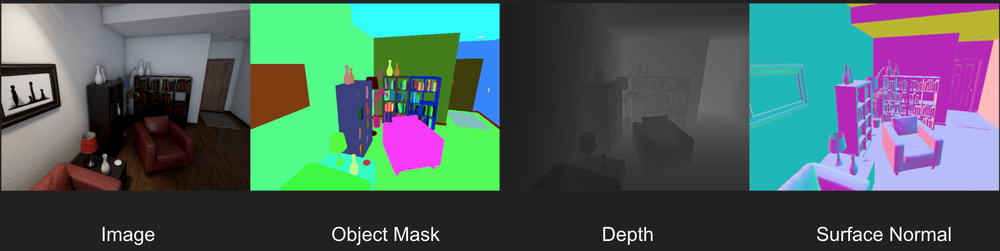

=======
Welcome
=======

UnrealCV helps computer vision researchers build virtual worlds using Unreal Engine 4 (UE4). It extends UE4 with a plugin by providing:

1. a set of UnrealCV commands to interact with the virtual world
2. Communication between UE4 and an external program, such as Caffe or tensorflow.

    Images generated from the technical demo :ref:`rr`

Currently, UnrealCV plugin supports UE4 (4.12, 4.13, 4.14) in Windows, Linux and Mac, more details about supported platforms in :ref:`this page <supported>`. UnrealCV client supports python and MATLAB (experimental). Read :doc:`getting started <tutorials/getting_started>` to learn how to use UnrealCV.

Tutorials are provided to help you get familiar with UnrealCV quickly and more technical details are documented in the reference section.

Tutorials
=========

- :doc:`tutorials/getting_started` - The basics of using UnrealCV, start from here.
- :doc:`tutorials/generate_images_tutorial` - Generate an image dataset with ground truth.
- :doc:`tutorials/faster_rcnn` - Show how to use images from a video game for testing faster RCNN.
- :doc:`plugin/install` - How to install UnrealCV plugin into UE4.

Reference
=========
- :doc:`reference/architecture` - Technical details of UnrealCV.
- :doc:`reference/commands` - All available commands provided in UnrealCV.

For the doc of a specific version of unrealcv, please see `the version page`_

.. _the version page: https://readthedocs.org/projects/unrealcv/versions/
.. _readthedocs: http://docs.unrealcv.org
