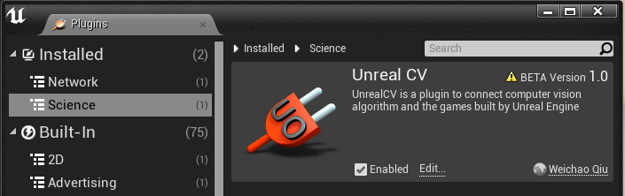

Install UnrealCV Plugin
=======================

This page briefly describes how to install UnrealCV as a UE4 plugin. Make sure you read :doc:`getting started </tutorials/getting_started>` before trying to use the plugin.

Use compiled plugin binary
--------------------------

You can download compiled UnrealCV binaries from our `github release page <https://github.com/unrealcv/unrealcv/releases>`_. Then copy the compiled binaries to the plugins folder to install it. Build it yourself by following the :ref:`compile_plugin`. You can install the plugin to either a game project or to UE4 engine.

- Install to project
    - Go to project folder which contains :file:`[ProjectName].uproject`
    - Create a folder called ``Plugins``
    - Put ``UnrealCV`` folder into the ``Plugins`` folder.
- Install to Unreal Engine
    - Go to the plugin folder of Unreal Engine which is ``Engine/Plugins``
    - Put ``UnrealCV`` folder into the ``Plugins`` folder.

Open ``Menu -> Edit -> Plugins``, make sure UnrealCV is installed and enabled. You have to be in play mode before you type the commands.

Install from UE4 marketplace (coming)
-------------------------------------

For Windows and Mac user, UnrealCV will be released to the UE4 marketplace. We are still finalizing the submission to the UE4 marketplace and it will be available soon.

.. _compile_plugin:

Compile from source code
------------------------

If you want to try a version of UnrealCV not provided in our `github release page <https://github.com/unrealcv/unrealcv/releases>`__, for example, you want to try some experimental features not released yet. Compiling the plugin code from source code is the only choice.

To compile UnrealCV plugin, use

.. code:: bash

    pip install -U unrealcv
	# Install the latest version of unrealcv, the build.py depends on unrealcv.automation module
    python build.py
    # This script will search common Unreal Engine folders of Windows and Mac
    # If this script fails to find UE4 installation path, you can also manually specify the engine path
    python build.py --UE4 {UE4}
    # For example
    # python build.py --UE4 "/Users/Shared/Epic Games/UE_4.16"

After running this command you should see ``Automation.Execute: BUILD SUCCESSFUL`` and the plugin binaries will be produced in the ``Plugins/UnrealCV`` folder. Then you can copy the compiled plugin to Plugins folder.

If you want to modify UnrealCV code and add new features. Please refer to the :doc:`development setup </plugin/develop>`. Setting up a dev environment takes a bit more time but will make it much easier to debug and modify code.

.. note::

    When using the plugin in the editor, it is strongly recommend to turn off the setting ``Editor Preference -> General -> Misc. -> Use Less CPU when in Background``.

Special tips for Linux
----------------------

In Linux, the Unreal Engine needs to be built from source code. How to compile from source code can be found in this official document `Building On Linux <https://wiki.unrealengine.com/Building_On_Linux>`__.

Previous versions of unrealcv depends on using OpenEXR module to generate depth, this requirement has been removed.
