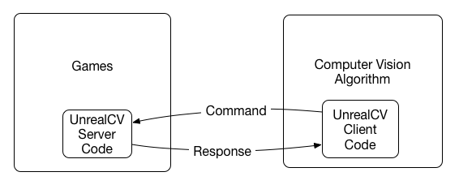

The architecture of UnrealCV
============================

    Fig.1: Architecture of UnrealCV

The focus of UnrealCV is to do IPC (Inter Process Communication) between a game and a computer vision algorithm. The communication can be summarized by Fig.1. A game created by Unreal Engine 4 will be extended by loading UnrealCV server as its module. When the game launches, UnrealCV will start a TCP server and wait for commands. Any program can use UnrealCV client code to send plain text UnrealCV command to control the scene or retrieve information. The design of UnrealCV makes it cross-platform and support multiple programming languages. The command system is designed in a modular way and can be easily extended.

Unrealcv consists two parts:

1. *unrealcv server* which is embedded into a video game.
2. *unrealcv client* uses commands to control the server.

.. The annotation is generated using the post processing effect of Unreal Engine. Buffer Visualization mode.

The initialization procedure of UnrealCV. The module loaded and start a TCP server waiting for connection. Commands will be parsed by regexp.

Project Layout
--------------

.. code:: bash

    client/            # Client code for Python and MATLAB
        examples/      # Examples showing how to use client code to do tasks
        matlab/        # MATLAB client
        python/        # Python client
        scripts/       # Scripts for tasks, such as building and packaging
    Content/           # Plugin data
    docs/              # Documentation of UnrealCV
    Resources/         # Plugin resource
    Source/            # Plugin C++ source code
    test/              # Test code
    UnrealCV.uplugin   # Descriptor file for an UE4 plugin
    README.md
