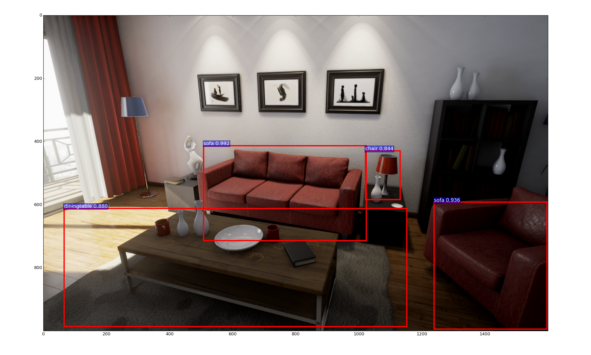

Model Zoo
=========

We provide compiled virtual worlds to play with. All the digital contents belong to the original author. If you want to use UnrealCV plugin in the editor, you can find UE4 projects in :doc:`/reference/ue4_resources`

.. Hint:: Model Zoo is still experimental. If you are a beginner, we highly recommend you start with RealisitcRendering to avoid unknown bugs. If you found any bugs, you can report `an issue <https://github.com/unrealcv/unrealcv/issues>`__. We will fix them as soon as possible.

.. TODO: add more formal license information
    The community maintained games will be hosted in the [github wiki page](http://).

.. Make sure links (all versions) in this page is always accesible. If I need to move files to a new place, link the new place. Do not use version in the filename, use _master.zip as suffix. So that when others share the link, they always share the _master link.

Run the downloaded binary

- In Mac: Run :code:`[ProjectName].app`
- In Linux: Run :code:`./[ProjectName]/Binaries/Linux/[ProjectName]`
- In Windows: Run :code:`[ProjectName]/[ProjectName].exe`

Read :doc:`/plugin/package`, if you are interested in sumbitting a binary to the model zoo.

.. _rr:

RealisticRendering
------------------

:Source: https://docs.unrealengine.com/latest/INT/Resources/Showcases/RealisticRendering/

:Preview:

:Description: Realistic Rendering is a demo created by Epic Games to show the rendering power of Unreal Engine 4. Here we provide an extended version of this demo with UnrealCV embedded.

:Plugin: 0.3.10

:Download:
    :bin:`Windows <RealisticRendering-Win-0.3.10.zip>`,
    :bin:`Linux <RealisticRendering-Linux-0.3.10.zip>`,
    :bin:`Mac <RealisticRendering-Mac-0.3.10.zip>`

- `Docker`

.. code:: bash

    `nvidia-docker run --name rr --rm -p 9000:9000 --env="DISPLAY" --volume="/tmp/.X11-unix:/tmp/.X11-unix:rw" qiuwch/rr:0.3.8`

ArchinteriorsVol2Scene1
-----------------------

:Source: https://www.unrealengine.com/marketplace/archinteriors-vol-2-scene-01

:Preview:

.. image:: https://image.ibb.co/jb2QCa/arch1.png

:Description: ArchinteriorsVol2Scene1 is a scene of a 2 floors apartment.

:Plugin: 0.3.10

:Download:
    :bin:`Windows <ArchinteriorsVol2Scene1-Win-0.3.10.zip>`,
    :bin:`Linux <ArchinteriorsVol2Scene1-Linux-0.3.10.zip>`,
    :bin:`Mac <ArchinteriorsVol2Scene1-Mac-0.3.10.zip>`

ArchinteriorsVol2Scene2
-----------------------

:Source: https://www.unrealengine.com/marketplace/archinteriors-vol-2-scene-02

:Preview:

.. image:: https://image.ibb.co/hwmkCa/arch2.png

:Description: ArchinteriorsVol2Scene2 is a scene of a house with 1 bedroom and 1 bathroom.

:Plugin: 0.3.10

:Download:
    :bin:`Windows <ArchinteriorsVol2Scene2-Win-0.3.10.zip>`,
    :bin:`Linux <ArchinteriorsVol2Scene2-Linux-0.3.10.zip>`,
    :bin:`Mac <ArchinteriorsVol2Scene2-Mac-0.3.10.zip>`

ArchinteriorsVol2Scene3
-----------------------

:Source: https://www.unrealengine.com/marketplace/archinteriors-vol-2-scene-03

:Preview:

.. image:: https://image.ibb.co/nyC3yF/arch3.png

:Description: ArchinteriorsVol2Scene3 is a scene of an office.

:Plugin: 0.3.10

:Download:
    :bin:`Windows <ArchinteriorsVol2Scene3-Win-0.3.10.zip>`,
    :bin:`Linux <ArchinteriorsVol2Scene3-Linux-0.3.10.zip>`,
    :bin:`Mac <ArchinteriorsVol2Scene3-Mac-0.3.10.zip>`,

UrbanCity
---------

:Source: https://www.unrealengine.com/marketplace/urban-city

:Preview:

.. image:: https://image.ibb.co/kgrJXa/urbancity.png

:Description: UrbanCity is a scene of a block of street.

:Plugin: 0.3.10

:Download:
    :bin:`Windows <UrbanCity-Win-0.3.10.zip>`,
    :bin:`Linux <UrbanCity-Linux-0.3.10.zip>`,
    :bin:`Mac <UrbanCity-Mac-0.3.10.zip>`
