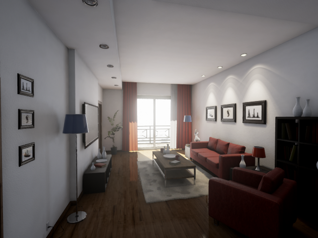
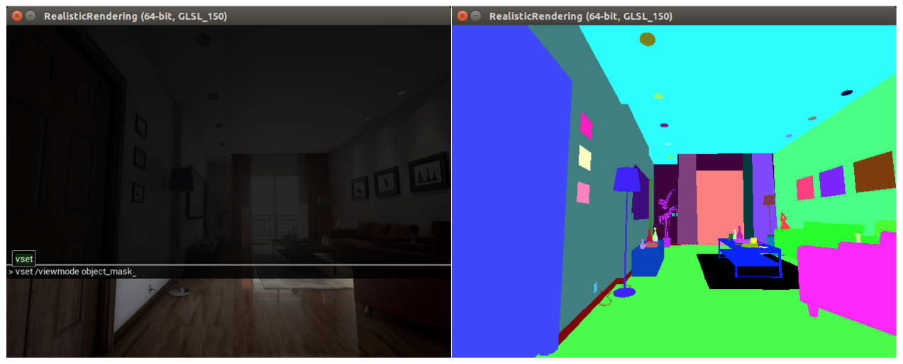

===============
Getting started
===============

This page introduces *UnrealCV commands* and how to use them to perform basic tasks. We also show how to use a python script to control an UnrealCV embedded game through these commands.

Download a game binary
======================

This tutorial will use a game binary to demonstrate UnrealCV commands. You can also :doc:`create your own game using UnrealCV plugin </plugin/package>`.

First you need to download a game binary from :doc:`our model zoo </reference/model_zoo>`. For this tutorial, please download :ref:`RealisticRendering <rr>`. After unzip and run the binary, you are expected to see a screen like this. The game will be started in a window mode with resolution 640x480, you can change the resolution by :doc:`changing the configuration file </plugin/config>` of UnrealCV.

    Initial screen of the game

Use mouse to look around and use keys :kbd:`w a s d` to navigate, use :kbd:`q e` to level the camera up and down. If you want to release mouse cursor from the game, press \` (the key on top of tab).

UnrealCV commands
=================

UnrealCV provides a set of commands for computer vision research. These commands are used to perform various tasks, such as control camera and get ground truth. The table below summaries commands used in this tutorial. The complete list can be found in :doc:`the command list </reference/commands>` in the reference section.

+-------------------------------------+---------------------------------------------------+
| Command                             | Help                                              |
+-------------------------------------+---------------------------------------------------+
| vset /viewmode [viewmode_name]      | Set ViewMode to (lit, normal, depth, object_mask) |
+-------------------------------------+---------------------------------------------------+
| vget /camera/0/lit                  | Save image to disk and return filename            |
+-------------------------------------+---------------------------------------------------+
| vset /camera/0/location [x] [y] [z] | Set camera location                               |
+-------------------------------------+---------------------------------------------------+

Try UnrealCV commands
---------------------

Unreal Engine provides a built-in console to help developers to debug games. This built-in console is a convenient way of trying UnrealCV commands. To open the console, press \`
(the key on top of tab) twice, a console will pop out, as shown in :numref:`fig_console`. Type in :code:`vset /viewmode object_mask` you are expected to see the object instance mask. Use :code:`vset /viewmode lit` to switch back to normal rendering setting.

.. _fig_console:

    Use console to try UnrealCV commands

Use python client to execute commands
=====================================

If we want to generate a large-scale synthetic dataset, or do active tasks, such as reinforcement learning, in this virtual world. We need to allow an intelligent agent to perceive, navigate and interact in the scene. We provide UnrealCV client to enable other programs to communicate with this virtual world. The client will use a :doc:`plain-text protocol </reference/architecture>` to exchange information with the game.

Here we use the python client for illustration. If you are looking for a MATLAB client, please see :ref:`the MATLAB client <matlab_client>`.

First, we need to install the python client library.

Install UnrealCV python library
-------------------------------

.. code:: shell

    pip install unrealcv

Generate some images from the scene
-----------------------------------

.. code:: python

    from unrealcv import client
    client.connect() # Connect to the game
    if not client.isconnected(): # Check if the connection is successfully established
      print 'UnrealCV server is not running. Run the game from http://unrealcv.github.io first.'
    else:
      filename = client.request('vget /camera/0/lit')
      filename = client.request('vget /camera/0/depth depth.exr')

You can find this example in :gitcode:`examples/10lines.py`.

If you encountered any errors following this tutorial, please see :doc:`the diagnosis </reference/issues>` page to find a solution.

Next: Use UnrealCV in the game mode or plugin mode?
---------------------------------------------------

For the game mode, you can use a compiled game binary. You can freely control the camera in this game and generate images and ground truth from it. But it is not easy to change the scene, such as add more objects or change the material properties. If you have access to an UE4 project and know how to use the UE4Editor, you can install the plugin to UE4Editor, so that you can combine the power of UE4Editor and UnrealCV to create new virtual worlds for research.

Tutorials
---------

- :doc:`How to generate an image dataset </tutorials/generate_images_tutorial>`
- :doc:`Integrate with a deep learning framework </tutorials/faster_rcnn>`
- :doc:`Use the plugin in UE4Editor </plugin/editor>`
- :doc:`Modify code and add a new command </plugin/develop>`

Articles
--------

- To fully understand how does UnrealCV work and the technical details, please read its :doc:`architecture </reference/architecture>` or `our paper <http://arxiv.org/abs/1609.01326>`_. For a complete list of available commands, please read :doc:`the command list </reference/commands>` in the reference section.
