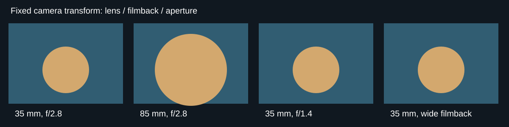
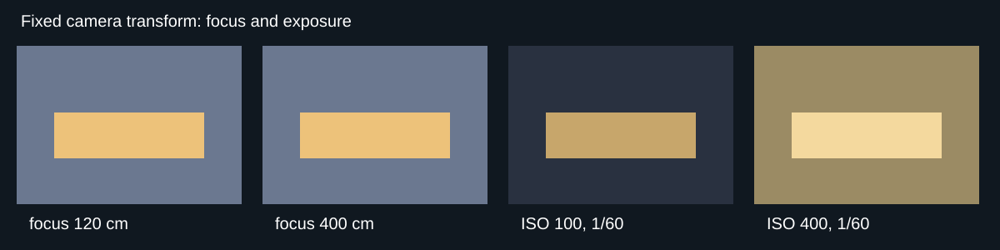

Cine camera parameter guide
===========================

The development Cine camera path keeps the camera at one fixed transform while
exposing Unreal's physical filmback, lens, focus, crop, clipping, and exposure
controls. The open-source command contract is documented in
:doc:`../../reference/cine_camera`; this page adds parameter-oriented examples
for the UnrealZoo development build.

Always record a short warm-up after changing a physical setting. Temporal
history, auto exposure, and Lumen need a few rendered frames before a capture
is representative.

Lens and filmback
-----------------

The following panels use the same camera location and rotation. Changing focal
length changes framing; changing filmback changes the field of view without
moving the camera. Aperture changes depth of field while preserving the camera
transform.

Focus and exposure
------------------

Manual focus is expressed in centimeters. ISO and shutter reciprocal are
physical exposure controls; keep the scene and camera fixed when comparing
values so the change is attributable to the parameter.

Reproduce the comparisons with commands such as::

    vset /camera/0/cine/enabled 1
    vset /camera/0/cine/lens 35 2.8
    vset /camera/0/cine/focus 250
    vset /camera/0/cine/exposure 100 60 1
    vget /camera/0/cine/intrinsics

Crop, overscan, and near clipping are covered by the command table in
:doc:`../../reference/cine_camera`.
